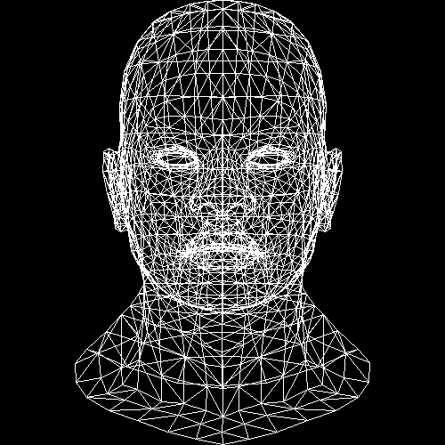
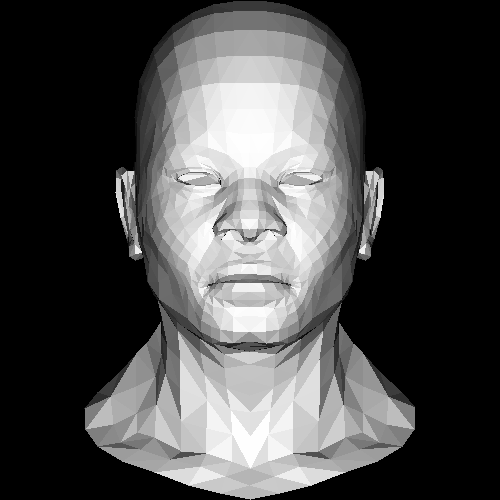
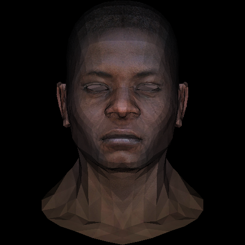
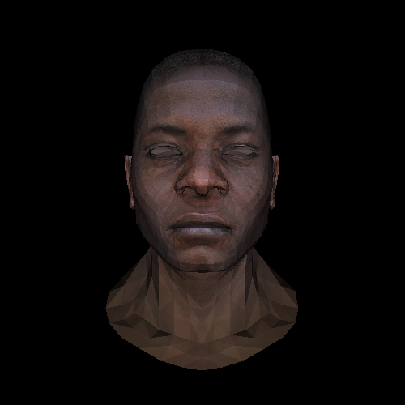

### Learning Rust by writing a simple renderer implementation

After using Scala for several years and learning Go for random system tools, I decided to start with Rust. No challenges suitable for Rust were encountered until I bumped into this [tutorial](http://habrahabr.ru/post/248153/) (in Russian), available and up-to-date [in English](https://github.com/ssloy/tinyrenderer/wiki). I love [OpenGL hacks](http://idea.hosting.lv/a/gfx/quakeshots.html)!

Day 1 is complete. Learned tons of nice and not-very-nice things about Rust.

Day 2 is complete. Adding [PistonDevelopers](https://github.com/PistonDevelopers/) to the game.

Day 3 is complete. Z-buffering!

Day 4 is complete. Diffuse texture.

Day 5 is complete. Perspective.

Day 6 is complete. Camera and light.

