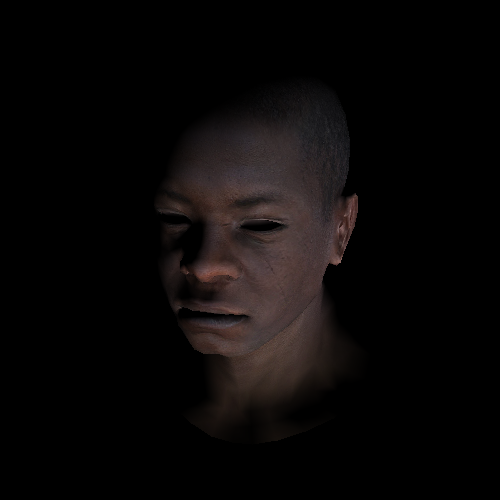

### Learning Rust by writing a simple renderer implementation

After using Scala for several years and learning Go for random system tools, I decided to start with Rust. No challenges suitable for Rust were encountered until I bumped into this [tutorial](http://habrahabr.ru/post/248153/) (in Russian), available and up-to-date [in English](https://github.com/ssloy/tinyrenderer/wiki). I love [OpenGL hacks](http://idea.hosting.lv/a/gfx/quakeshots.html)!

Day 1 - Learned tons of nice and not-very-nice things about Rust.

Day 2 - Adding [PistonDevelopers](https://github.com/PistonDevelopers/) to the game.

Day 3 - Z-buffering!

Day 4 - Diffuse texture.

Day 5 - Perspective.

Day 6 - Camera and light.

Day 7 - Perspective divide aware interpolation.

Day 8 - Normal mapping.

